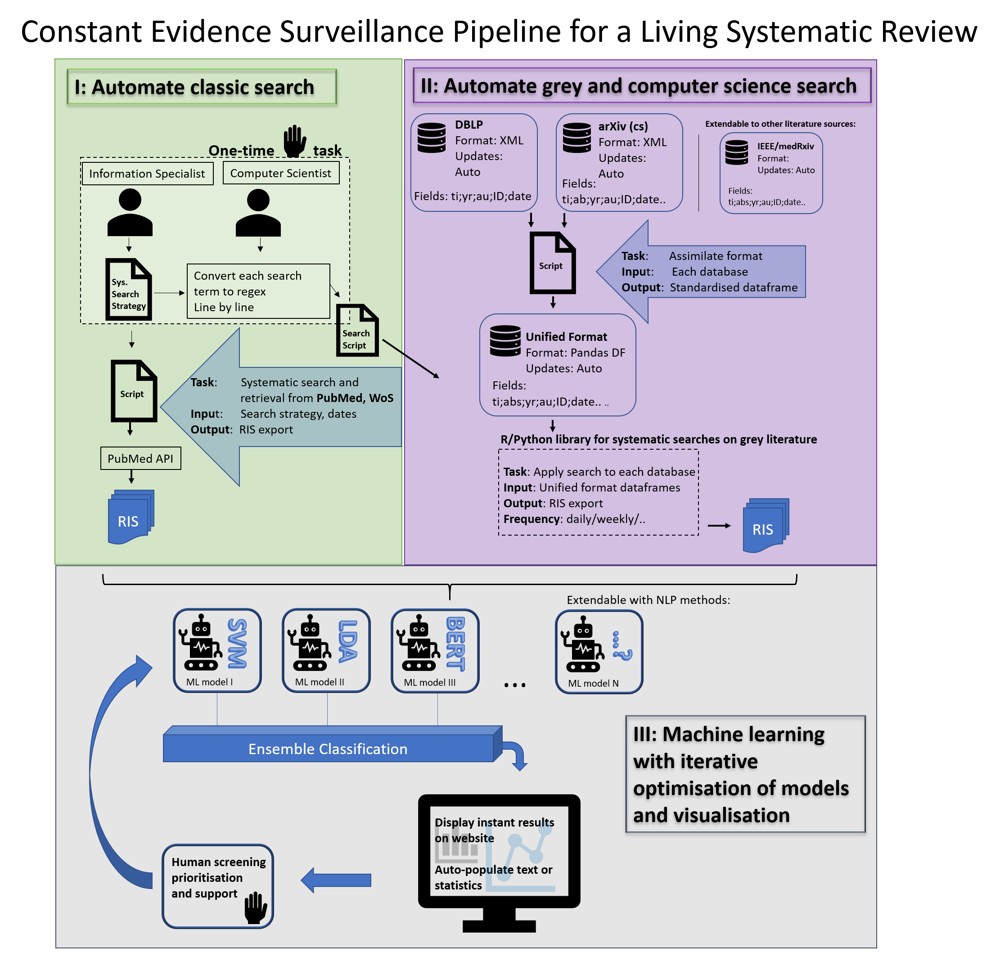

# Data extraction methods for systematic review (semi)automation: A living review

## About
This repository contains the code and templates used to develop an evidence surveillance pipeline for our living review on data extraction methods for systematic review (semi)automation.

## Authors
Lena Schmidt   
Babatunde K. Olorisade   
Luke A. McGuinness   
Julian P.T. Higgins  

## Overview

